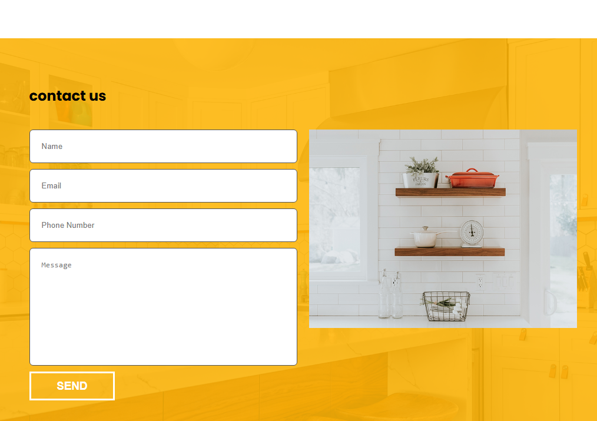

# Built Better Temlate For Furniture

## What technology is used here?

I used Html, Css, Fontawesome for icons, Javascript.

## Template Review

### Landing Page

### services Section

### About us

### Furniture Section

### Who We Are Section

### Projets

### Testiminials Section

### Contact us

### Footer Section

## Links

- Facebook
  https://www.facebook.com/profile.php?id=100085749470017

- X
  https://twitter.com/ahmed_magdy135
